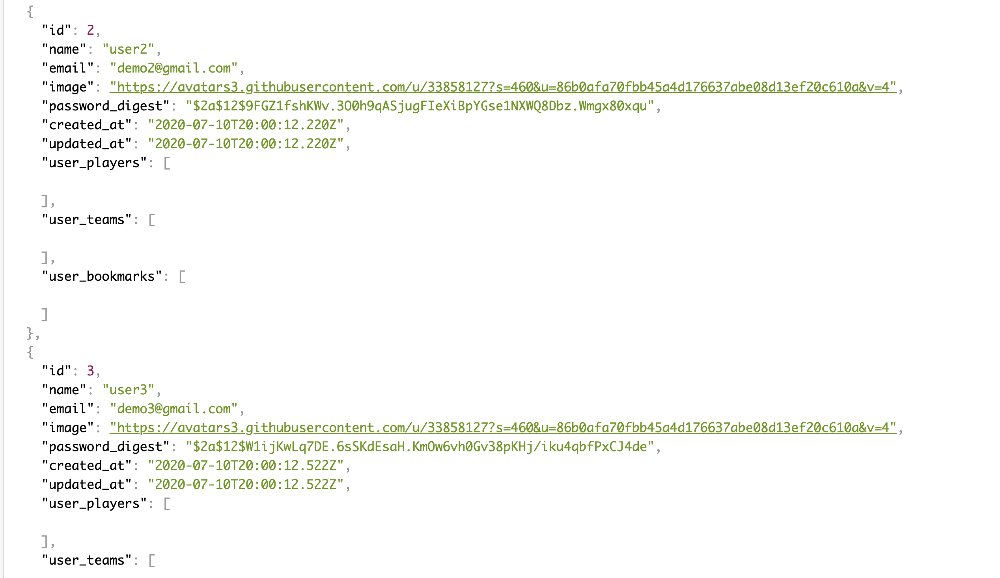

# SPN - BackEnd

Ruby Version => '2.6.1'

## Summary 

This is a sports news aggregator designed to get all of your daily news in the sports world, as well as in the NBA.  A user can either sign-up or sign-in and follow NBA teams or players, and read up on their favorite sports teams.  If you dont want to follow a player, no problem!  You can unfollow a player or team and continue using the app.  If there is a spcific news article you like go ahead and bookmark it, and read it later on your profile page!  I hope you enjoy using my app and continue following some of the best sports news in the world!

(Due to changes to the News API CORS restrictions, news will need to be updated by seeding the backend postgreSQL database)

## Instructions

1. Clone down this repo and cd into the directory

2. Create Your Own Secret Key. This repo relies on the JWT ruby gem to generate user tokens to be stored in localstorage. JWT requires a secret key to decode and encode user information. Create a .env file in the top level of the directory to store your secret key. This file should already be added to gitIgnore and will not be pushed to gitHub. Your .env file should look something like this: SECRET_KEY= 'YourSecretKeyString'

3. Run bundle install

4. Run rails db:migrate

5. Run rails db:seed

6. Run rails s

7. Rails should be running the api on http://localhost:3000. You can check the users route going to http://localhost:3000/users in your browser.

8. Clone down the BrackIt Frontend Repo and follow the frontend Readme instructions!

9. If you have previously downloaded and ran this repo, you may encounter a localstorage error if a locally stored token is invalid in your new database. Run localstorage.clear() in your console.

## RSpec Tests 

1. There are tests for backend models written in Rpec

2. Make sure models are running successfully by running rspec